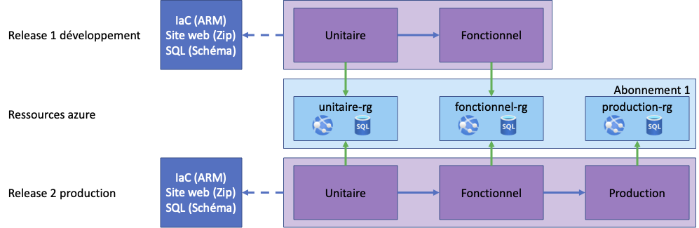

# Travail pratique 2 - Déploiement continue

## Informations

- Remise du travail: 26 avril 2023, 23:59
- Ce travail est réalisé en équipe de 2 personnes et seuls les membres de cette équipe y contribuent
- Toutes les réponses fournies doivent être originales (produites par l’étudiant ou un membre de l’équipe)
- Toute copie de code, de portion de code, d’algorithme ou de texte doit faire mention de sa source
- L’emprunt ou la copie de code ou de portions de code est interdite
- Tout constat de plagiat, tricherie ou fraude sera automatiquement déclaré à la Direction et les sanctions prévues seront appliquées
- Durée : 2 x 3 heures + travail à la maison
- Plate forme : Azure, Azure DevOps, Visual Studio Code et dotnet/react
- Pas d'utilisation de Visual Studio (vous êtes des DevOps et l'entreprise ne paie pas de licence pour cela) : vous devez tout faire ne ligne de commande

## Objectifs

- Montrer que vous avez compris la création d'artefacts (CI)
- Montrer que vous avez compris la création de ressources sur Azure par l’infrastructure as code (IaC)
- Montrer que vous avez compris le principe de déploiement continue et son intégration dans le cycle DevOps
- Créer deux pipelines de déploiement continue dans Azure DevOps
- Créer trois environnements de déploiement dans Azure
- Être capable d'expliquer la partie théorique et technique

## Remise

- Vidéo sur YouTube (non listée - autour de 10 mins maximum ! Pénalités si dépassé !) (30 points):
  - Explication des pipelines de CI (5 points)
  - Explication et démonstration des pipelines de CD avec les variables et la modification des fichiers appsettings.json (20 points)
  - Démonstration du fonctionnement de l'application sur les trois environnements (5 points)
- Manuels d'utilisation du pipeline de déploiement continu pour le développeur et les approbateurs (10 points)
- Copies d'écran (pipelines) (10 points CI + 30 points CD) :
  - Liste des tâches
  - Paramètres de chaque tâche
  - Variables
  - L'ordre logique des images est indiqué par le tri des noms de fichier par ordre lexicographique ou les copies d'écran sont dans un fichier Word ou PDF
- Répartition des tâches entre partenaires avec nombre d'heures par partenaire et total (5 points)
- Ajoutez `pfleon@csfoy.ca` comme utilisateur et administrateur avec une licence de type Basic (Le faire au niveau de l'organisation) (-10 points si je dois courir après vous)
- Répondre aux questions suivantes (15 points):
  - En quoi l'utilisation des outils DevOps permet une bonne compréhension entre les équipes et une diminution des risques lors du déploiement ?
  - En quoi est-il plus approprié d'utiliser un service PaaS pour la base de données et l'application Web plutôt que des services de VM ? (Comparez le coût des ressources et essayez d'évaluer les avantages inconvénients du PaaS vs IaaS dans notre situation)
- Fichier `AUTHORS.md` : (Jusqu'à -10 points pour non respect des consignes)
  - lien YouTube
  - lien du projet sur Azure DevOps
  - Vos informations (prénom / nom / matricule)
  - le fichier doit être remis dans l'archive zip sur Léa

En résumé, ce qui est noté est ce qui est dans l'archive zip sur Léa à l'exception de la vidéo sur YouTube dont je dois trouver le lien dans le fichier `AUTHORS.md`.

## Projet

Le projet est écrit en .Net 6.0. Il se trouve dans le répertoire ```src``` du présent répertoire.

## Étape 1 - Gestion de source et intégration continue

Vous devez mettre le projet sous contrôle de source et mettre en place des pipelines d'intégration continue afin d'améliorer la traçabilité et la qualité logicielle.

- Vous devez créer un nouveau projet d'équipe et y ajouter le code du projet dans le dépôt par défaut dans la branche "main" (n'oubliez pas le .gitignore !)
- Vous devez créer une branche "develop"
- Vous devez créer un pipeline classic ou YAML d'intégration continue qui construit 4 artefacts (donc 4 "Azure publish" et non 1 comme dans les exercices) : un pour l'interface utilisateur (GC.ConsoleUI), un par traitement lot (GC.Batch.ModifierNomPrenomPremiereLettreMajuscules et GC.Batch.ModifierPaysMajusculesClients) et un pour le projet Web (GC.WebReact)
- Les pipelines doivent se déclencher automatiquement à chaque modification des branches "main" et "develop"

## Étape 2 - Création des ressources Azure

Vous devez créer les ressources Azure nécessaires pour le déploiement continu. La seule partie de l'application a déployer est l'application Web (GC.WebReact). Vous devez créer les ressources suivantes :

- Un groupe de ressources
- Une base de données SQL
- Un site Web

**Attention au type de ressources que vous créez, vous devez utiliser les ressources gratuites ou peu coûteuses !**

Mettez vos ressources ARM dans un nouveau dépôt Git (pas le même que celui du projet) et créez un pipeline d'intégration continue qui va créer un artefact avec les ressources Azure. Vous devez créer un pipeline classic ou YAML (le même type que celui de l'étape 1).

## Étape 3 - Déploiement continu

Vous devez créer deux pipelines de déploiement continu qui va déployer l'application Web (GC.WebReact) dans l'environnement de développement.

Chaque pipeline de déploiement doit :

- Modifier le fichier appsettings.json pour y mettre les bonnes valeurs de connexion à la base de données (`DefaultConnection`) et de l'URL du service d'identité (`IssuerUri`)
- Déployer les ressources Azure (artefacts du pipeline de l'étape 2)
- Déployer l'application Web (artefacts du pipeline de l'étape 1)

Le premier pipeline doit déployer dans l'environnement de développement et le second dans l'environnement de production.

Le pipeline dédié aux environnements de développement doit être déclenché automatiquement à chaque modification de la branche "develop". Le pipeline dédié aux environnements de développement et celui de production doit être déclenché manuellement à chaque modification de la branche "main".

Le pipeline de déploiement dédié aux environnements de développement doit être déployé dans deux environnements de déploiement différents : "unitaire" et "fonctionnel". L'environnement "unitaire" doit être déployé dans un groupe de ressources différent de l'environnement "fonctionnel". L'environnement "fonctionnel" doit être déployé automatiquement en cas de réussite des précédents sur acceptation d'individus spécifiques. Pour le projet, ajouter un des binômes ainsi que mon compte (Voir les "gates").

Le pipeline de déploiement dédié aux environnements de développement et celui de production doit être déployé dans trois environnements de déploiement : "unitaire", "fonctionnel" et "production". L'environnement "unitaire" doit être déployé dans un groupe de ressources différent de l'environnement "fonctionnel" et de l'environnement "production". L'environnement "fonctionnel" doit être déployé automatiquement en cas de réussite des précédents sur acceptation d'individus spécifiques. L'environnement "production" doit être déployé automatiquement en cas de réussite des précédents sur acceptation d'individus spécifiques. Pour le projet, ajouter un des binômes ainsi que mon compte (Voir les approbations).



Tout partage de code, d'explication, de bouts de texte, etc. est considéré comme du plagiat. Pour plus de détails, consultez le site (et ses vidéos) [Sois intègre du Cégep de Sainte-Foy](http://csfoy.ca/soisintegre) ainsi que [l'article 6.1.12 de la PÉA](https://www.csfoy.ca/fileadmin/documents/notre_cegep/politiques_et_reglements/5.9_PolitiqueEvaluationApprentissages_2019.pdf)

## Validations rapides de l'état du site

Vous pouvez effectuer une requête GET sur l'URL suivante :

- Pour valider que le site est en ligne : `https://<nom-du-site>.azurewebsites.net/healthz/live`
- Pour valider la connectivité à la base de données : `https://<nom-du-site>.azurewebsites.net/healthz/db`

## Rappel - débugage

Si vous avez des erreurs au moment du déploiement, vous pouvez :

- Validez que vous avez bien tous les artefacts
- Ajouter une étape de débogage dans votre pipeline de déploiement en ajoutant des tâches `Bash` ou `PowerShell` pour afficher les valeurs des variables d'environnement, le contenu des fichiers de configuration ou le contenu des répertoires (tree)

Si vous avez des erreurs une fois l'application déployée, vous pouvez :

- Sur le portail azure, alidez que vous avez bien créé un `App service` de type Linux
- Dans votre pipeline de déploiement, validez que l'étape de déploiement de l'application Web est bien configurée pour `Linux` et non `Windows`
- Validez votre chaine de connection en allant consulter le fichier appsettings à partir du portail Azure :
  - À partir de la ressource de l'application Web, allez dans le menu  `Outils de développement > Outils avancés` puis `accéder`
- À partir du portail Azure, consultez le journal de votre application `Supervision > Flux de journaux`
- À partir du portail Azure, vous pouvez aussi passer l'application en mode développement en ajoutant le paramètre `ASPNETCORE_ENVIRONMENT=Development` pour cela, allez dans le menu `Paramètres > Configuration` et ajoutez le paramètre d'application `ASPNETCORE_ENVIRONMENT` avec la valeur `Development`. Allez ensuite dans le menu `Vue d'ensemble` et arrêtez et démarrez l'application. Le site devrait alors afficher les exceptions.

## Bugs Azure et contournements

- En copiant un stage, certains ont eu la mauvaise surprise d'avoir des déploiements d'ARMs qui étaient validés mais qui n'était plus trouvés au moment de la création affective. Pour contourner ce problème, la solution qui paraissait fonctionner est de retourner dans la tâche qui échoue en remettant explicitement la valeur qui s'y trouve déjà, ici les noms du fichiers de modèles de gabarit et de paramètres. Même si le comportement et la solution semblent incohérents, cette voie de contournement a résolue le problème dans la plupart des cas.
